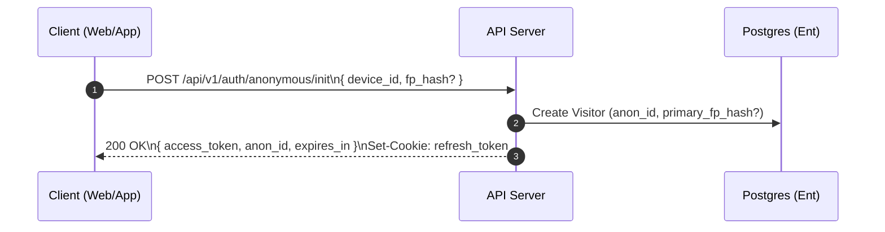
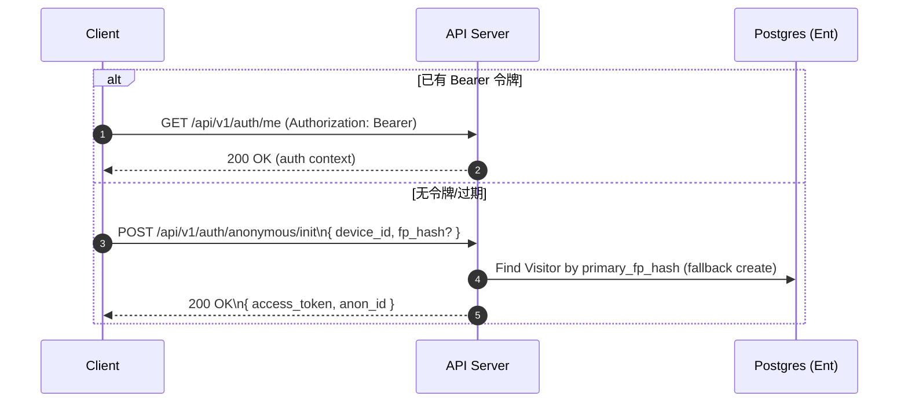
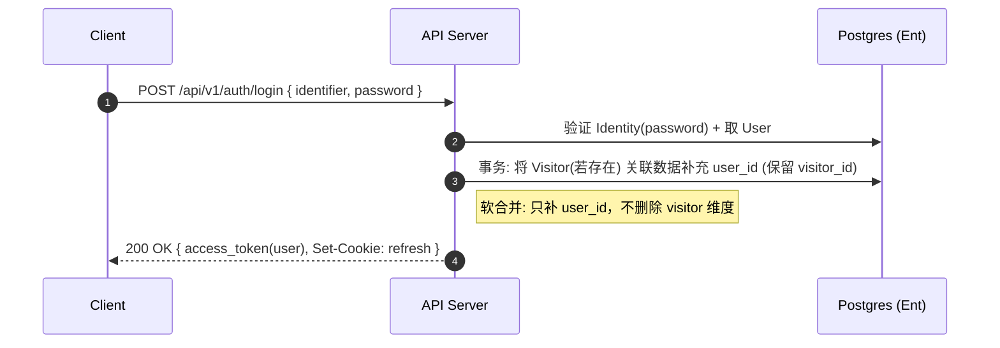

# anon_id 的作用

## 作用概述
- 匿名标识符：`anon_id` 是服务端生成的随机、稳定、不可预测的访客标识（每浏览器/设备一份）。
- 关联主键：用于在未登录阶段，把同一访客的指纹、设备、事件等数据关联到同一个 `Visitor` 实体。
- 恢复身份：当匿名 JWT 过期或丢失时，靠 `anon_id` 快速找回既有 `Visitor`，避免“新访客”被误创建。

## 为什么需要
- 指纹易变：`fp_hash` 会因浏览器升级、插件/字体/抗指纹策略变化而漂移；`anon_id` 作为稳定锚点兜底。
- 避免误合并：指纹可能碰撞或不唯一，有 `anon_id` 可优先命中正确访客，降低合并错误。
- 反滥用/限流：与 `ip`、`fp_hash`、`device_id` 组合做登录/注册/刷新限流，更精确。

## 使用方式
- 首访：前端调用 `/api/v1/auth/anonymous/init` 上报 `device_id`、`fp_hash`；服务端创建 `Visitor` 并生成 `anon_id`（返回并通常种到 Cookie）。
- 回访（无 JWT）：读取 `anon_id` 命中 `Visitor`；若缺失则用 `fp_hash` 命中，命中失败再创建新 `Visitor` 并下发新 `anon_id`。
- 登录后合并：将该 `Visitor` 产生的历史记录补充 `user_id`（保留 `visitor_id` 以可追溯），`anon_id` 仍可用于后续匿名期识别。

## 与 fp_hash / device_id / JWT 的关系
- `anon_id`：稳定的服务端发号，优先匹配；不用于授权。
- `fp_hash`：浏览器侧特征哈希，可能变动；用于辅助匹配/回填。
- `device_id`：前端生成的设备实例 ID，便于多设备区分与刷新令牌绑定。
- JWT：承载访问授权（`sub=user:<uuid>` 或 `visitor:<uuid>`）；`anon_id` 仅用于识别与找回 `Visitor`，不是凭证。

## 生命周期与存储建议
- 介质：建议 Cookie，`SameSite=Lax`，可选 `HttpOnly` 防止脚本篡改（若前端需要读取再用非 HttpOnly）；过期 90–180 天。
- 再生成：用户清 Cookie 或选择“退出追踪”时重置 `anon_id`；服务端关闭旧 `anon_id` 对应的活跃匿名态。
- 碰撞处理：同 `fp_hash` 命中多个 `Visitor` 时，以 `anon_id` 为准；无 `anon_id` 时保守创建新访客，避免误合并。

## 安全与合规
- 非凭证：`anon_id` 绝不用于鉴权或赋权；仅作弱标识。
- 最小化：只存 `anon_id` 本身与时间戳；指纹存哈希，不保留原始特征。
- 合规：作为“可识别标识”，应纳入隐私告知/同意；提供退出与删除能力；尊重 DNT。

## 时序图

### 初次访问（Anonymous Init）



建议客户端将 `anon_id` 持久化（Cookie 或 LocalStorage），并在后续匿名期保留；访问鉴权依赖返回的 `access_token`（Bearer）。

### 回访（无访问令牌）



说明：当前 MVP 通过 `fp_hash` 回表命中已存在的 `Visitor`；若失败将创建新访客并下发新的 `anon_id`。可选增强是让客户端携带已存的 `anon_id` 以提高命中率（例如作为 Header/Cookie）。

## 接口示例

### 1) 匿名初始化

请求

```bash
curl -X POST http://localhost:8080/api/v1/auth/anonymous/init \
  -H 'Content-Type: application/json' \
  -d '{
    "device_id": "web-uuid-123",
    "fp_hash":   "sha256:abcdef..."
  }'
```

响应（摘要）

```json
{
  "code": "OK",
  "message": "success",
  "data": {
    "access_token": "<JWT>",
    "token_type": "Bearer",
    "expires_in": 900,
    "anon_id": "8a0d1b7c-..."
  }
}
```

注意：同时会设置 HttpOnly `refresh_token` Cookie（SameSite=Lax）。

### 2) 刷新访问令牌

请求（依赖 `refresh_token` Cookie）

```bash
curl -X POST http://localhost:8080/api/v1/auth/refresh \
  -H 'Content-Type: application/json' \
  --cookie "refresh_token=<REFRESH_JWT>"
```

响应（摘要）

```json
{
  "code": "OK",
  "message": "success",
  "data": {
    "access_token": "<NEW_JWT>",
    "token_type": "Bearer",
    "expires_in": 900
  }
}
```

### 3) 获取当前身份（匿名或登录）

```bash
curl http://localhost:8080/api/v1/auth/me \
  -H 'Authorization: Bearer <JWT>'
```

响应（示例）

```json
{
  "code": "OK",
  "message": "success",
  "data": {
    "subject": "visitor:8a0d1b7c-...",
    "kind": "anon",
    "roles": []
  }
}
```

## 设计扩展建议
- 前端在可行时携带 `anon_id`（如 `X-Anon-Id` Header 或非 HttpOnly Cookie），服务端优先以 `anon_id` 命中。
- 为匿名合并设置幂等策略：同一 `visitor_id` 多次合并不重复写入。
- 统一限流键：`ip + device_id + (anon_id|fp_hash)`，针对匿名 `init/refresh/login` 等接口限流。

## 登录后匿名数据合并（软合并）

### 时序图



### 关键点
- 事务与幂等：同一 `visitor_id` 重复合并不会产生重复/冲突。
- 可追溯：保留 `visitor_id` 字段，便于还原未登录期行为。
- 范围：可按需为 `Device`/`Fingerprint`/`Event` 等写入 `user_id`。
- 回滚策略：合并失败则整体回滚，不影响既有匿名数据。

### 示例（伪代码）

```sql
BEGIN;
-- 仅当客户端携带 anon_id 或服务端能命中当前 Visitor 时执行
UPDATE devices SET user_id = $USER_ID WHERE visitor_id = $VISITOR_ID;
UPDATE fingerprints SET user_id = $USER_ID WHERE visitor_id = $VISITOR_ID;
-- 可选: 事件/订单等历史表
COMMIT;
```
